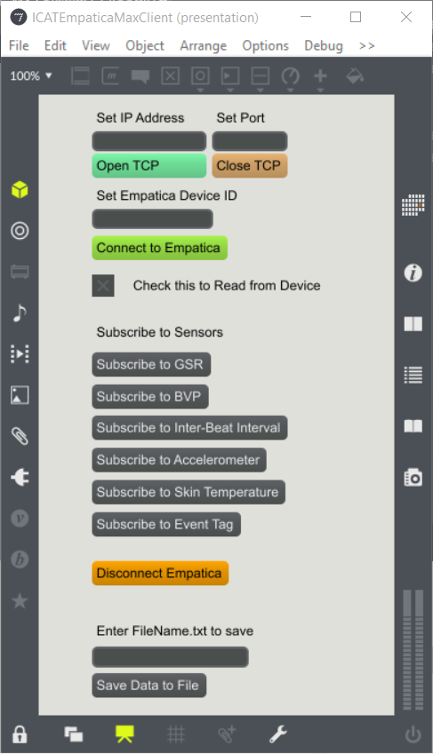

# EmpaticaMaxMSPClient
Empatica BLE Client for MaxMSP 

This Max Patch provides GUI to communicate with the Empatica Windows BLE Server, whose working is described in [http://developer.empatica.com/windows-ble-server.html].

The user interface is simple and looks like this:

Dependencies: 
* Needs TCPClient available at https://cycling74.com/toolbox/tcpclient/ [Follow the instructions on their page to install]

Usage:
* Open Patch by running ICATEmpaticaMaxMSPClient.maxpat
* Enter the IP:Port of the machine where Windows BLE server is running.
* Enter the device ID for Empatica Device you wish to connect to [can be seen from the Windows BLE Server].
* Click the "Connect to Empatica" button.
* Click the checkbox which is to enable printing the TCPclient output to the Max console
* Select any data streams (multiple possible) you wish to capture. The output is dumped in the console (as well as you can choose to write to a file later on)
* When done, click "Disconnect Empatica" button to close the connection. 
* Close the TCP connection.
* Enter the name of the file you want to save the data to, in the format `filename.txt`.
* Click "Save Data to File" button.
